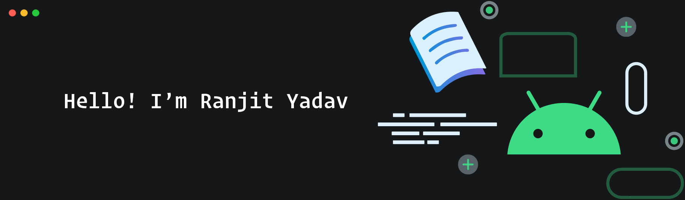

<!--  -->

## About Me:

- 💻 I'm a Software Developer from India.
- 🌱 I’m currently learning React JS.
- 💬 Ask me about tech in general or Sofware Engineering.
- ⚡ Fun fact: I'm single 😉

## Technologies:

## Languages:

## How to reach me:

[][linkedin]
[][twitter]
[][instagram]

  
:zap: Most Used Languages

  

  
:zap: GitHub Stats

  

 

<b>Visitors Count</b>
  

<!-- Links -->

[twitter]: https://twitter.com/13yadav_
[instagram]: https://instagram.com/13yadav
[linkedin]: https://linkedin.com/in/13yadav
[github]: https://github.com/13yadav
