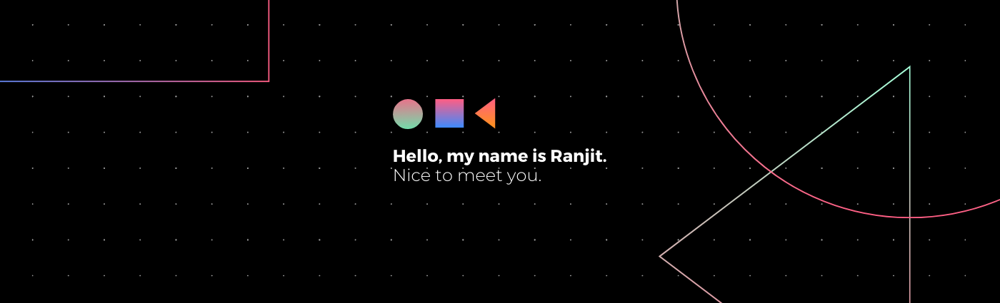

    

## About Me:
- 🔭I'm an Android Developer from India.
- 🌱 I’m currently learning more about Jetpack Components, Flutter, Android development(Forever).
- 💬 Ask me about Android in general or Jetpack Components.
- 🥅 ~~2020~~ All Time Goals: Learn more Grow more...
- ⚡ Fun fact: I'm single😁

## How to reach me:
[][twitter]
[][linkedin]
[][instagram]
[][facebook]

## Tools & Technologies:

<!-- Links -->
[twitter]: https://twitter.com/imranjityadav
[instagram]: https://instagram.com/13yadav
[linkedin]: https://linkedin.com/in/13yadav
[facebook]: https://facebook.com/13ydv
[github]: https://github.com/13yadav